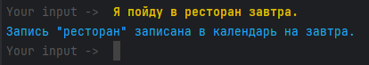
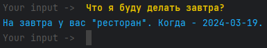
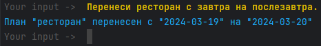
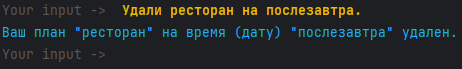

Этот проект выполняет функцию ежедневника, позволяя пользователю записывать, считывать,
обновлять и удалять планы (время и место), управляя сервисом с помощью естественной речи.
***
Как развернуть сервис?
1. Скачать zip версию проекта.
2. Распаковать.
3. Установить Python3.9 (https://www.microsoft.com/store/productId/9P7QFQMJRFP7?ocid=pdpshare).
4. Выбрать интерпретатор Python3.9 (путь: C:\Users\*пользователь*\AppData\Local\Microsoft\WindowsApps\python3.9.exe )
5. Создать виртуальное окружение командой "python -m venv venv".
6. pip install --upgrade pip==23.2.1
7. Активировать виртуальное окружение командой  "venv\Scripts\activate.bat" (windows cmd),   "source ./venv/bin/activate" (linux),   "venv/Scripts/Activate.ps1" (windows PowerShell).
8. Установить зависимости проекта командой "pip install -r requirements.txt --no-cache-dir" из папки с проектом.
9. Обучить модель с помощью команды "rasa train".
10. После обучения запустить модель командой "rasa shell".
11. Открыть еще один терминал, перейти в папку с проектом и активировать виртуальное окружение командой ".\venv\Scripts\activate"
12. Запустить custom actions, введя команду "rasa run actions" в 2 терминале.
13. Использовать бота, активируя один из 4 навыков (запись, чтение, обновление и удаление данных из ежедневника), в 1 терминале.
***
Что можно улучшить?
1. Перейти с sqlite3 на mysql/postgres.
2. Добавить custom exceptions для более точной реализации навыков CRUD (более точного вывода информации об ошибках).
3. Добавить больше примеров для каждого intent в целях улучшения распознавания.
***
Пример работы проекта:
1. Запись в ежедневник.

2. Чтение из ежедневника.

3. Обновление в ежедневнике.

4. Удаление из ежедневника.

